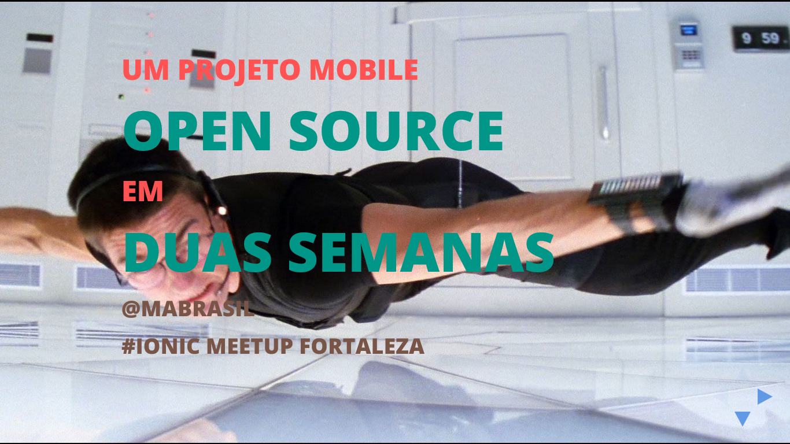

# Um projeto mobile open source em duas semanas *(ou uma talk sobre como melhorar seu workflow Ionic)*

## The talk

- **Title:** *Um projeto mobile open source em duas semanas (ou uma talk sobre como melhorar seu workflow Ionic)*
- **When:** August, 15
- **Where:** Universidade de Fortaleza - Unifor.
- **Attendees:** ≈40
- **Description:** In this talk I'll share some of the experiences I had while working on [Conf App Boilerplate](https://github.com/devevents/conf-app-boilerplate) - which aimed to be used to develop the [Front In Fortaleza mobile app](https://play.google.com/store/apps/details?id=com.devevents.frontinfortaleza) in *two weeks*. You'll see how we used trending technologies like [Jade](http://jade-lang.com/), [SASS](http://sass-lang.com/), [Typescript](http://www.typescriptlang.org/), [Gulp](http://gulpjs.com/) - and many others -, to help our code gain in aspects of readability and maintainability - and our team, productivity.
- **Presentation:** [See it live here](http://mabrasil.github.io/talks/2015/ionic-meetup/).

## The slides

These slides are made using [xzibit](https://github.com/mabrasil/xzibit) v.1.0.0. To get more info on how to run and that kind of things, visit the project's page.

The slides' content is licensed under a [Creative Commons Attribution 3.0 Unported License](http://creativecommons.org/licenses/by/3.0/deed.en_GB).
